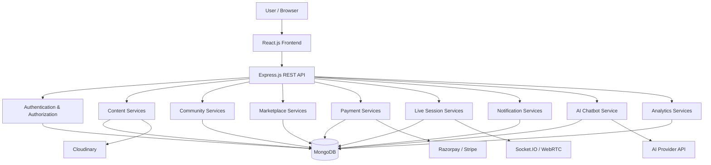

# Nimisham

### A Web-Based Platform for Photography, AI Art, Learning, and Digital Marketplace

---

## Overview

**Nimisham** (meaning *"Moment"*) is a comprehensive web-based creative platform built as an MCA Mini Project. It enables photographers and AI artists to showcase their work, document their creative process, share knowledge, conduct live learning sessions, sell digital creative resources, interact with a creative community, and receive intelligent assistance through an AI-powered chatbot.

Unlike conventional image-sharing platforms, Nimisham is an **integrated creator ecosystem** that bridges portfolio showcasing, educational content, community interaction, a digital marketplace, and AI-powered assistance into a single cohesive platform.

---

## Problem Statement

Photography and AI-generated art platforms primarily focus on image sharing and social engagement, while providing limited support for:

- Documenting creative processes
- Knowledge sharing and educational content
- Professional growth and creator analytics
- Digital resource selling (presets, prompts, LUTs)
- Interactive live learning sessions

Nimisham addresses this gap by combining creative portfolio showcasing, process documentation, tutorials, community features, a digital marketplace with secure delivery, live workshops, and AI-powered assistance into one platform.

---

## Objectives

1. **Showcase & Sell** — Develop a web-based platform that enables photographers and AI artists to professionally showcase and sell their creative works.
2. **Teach & Share** — Provide facilities for sharing tutorials, editing workflows, presets, AI prompts, and conducting live interactive learning sessions.
3. **Connect & Discover** — Promote collaboration, knowledge sharing, and user engagement through community features, an AI-powered chatbot, and a secure digital marketplace.

---

## Core Features

### 🎨 Creative Portfolio

- Photography & AI artwork uploads with rich metadata
- Creative process documentation
- Portfolio management with featured works

### 📚 Learning & Education

- Tutorials with draft/publish workflow
- Preset & AI prompt sharing
- Live sessions & workshops (Socket.IO / WebRTC)

### 🛒 Digital Marketplace

- Product listings for digital creative resources
- Shopping cart & checkout
- Secure payments (Razorpay / Stripe)
- Protected digital asset delivery

### 👥 Community

- Likes, comments, bookmarks
- Follow creators
- Search, categories, and discovery

### 🤖 AI Assistance

- Platform-aware chatbot for creative & navigational help
- Recommendations based on user activity

### 🛡️ Administration

- User & content moderation
- Marketplace oversight
- Platform analytics & reporting

---

## Technology Stack

| Layer             | Technology                 |
| ----------------- | -------------------------- |
| **Frontend**      | React.js, Tailwind CSS     |
| **Backend**       | Node.js, Express.js        |
| **Database**      | MongoDB                    |
| **AI**            | AI-powered Chatbot         |
| **Storage**       | Cloudinary                 |
| **Payments**      | Razorpay / Stripe          |
| **Real-Time**     | Socket.IO, WebRTC          |
| **Auth**          | JWT, bcrypt                |
| **Tools**         | Git, GitHub, Postman, VS Code |

---

## System Architecture



---

## Module Overview

Nimisham is decomposed into **20 official modules** organized across 7 development phases:

| #  | Module                          | Description                                              |
| -- | ------------------------------- | -------------------------------------------------------- |
| 01 | Authentication                  | Registration, login, JWT, password management            |
| 02 | User Profile & Creator Identity | Profile management, creator identity, public profiles    |
| 03 | Role & Access Management        | RBAC — User, Creator, Admin roles and authorization      |
| 04 | Artwork & Photography Upload    | Image uploads with photography & AI metadata             |
| 05 | Creative Process Documentation  | Document inspiration, workflow, tools, and techniques     |
| 06 | Portfolio Management            | Organize works into portfolios with featured projects     |
| 07 | Tutorial & Educational Content  | Create and publish tutorials and learning resources       |
| 08 | Preset & AI Prompt Sharing      | Share presets, LUTs, and AI prompts (free & paid)         |
| 09 | Community Interaction           | Likes, comments, bookmarks, follows, sharing              |
| 10 | Search, Discovery & Categories  | Search, filter, and discover content across the platform  |
| 11 | Digital Marketplace             | Product listings for digital creative resources            |
| 12 | Shopping Cart & Orders          | Cart management, checkout, order history                   |
| 13 | Payment & Transactions          | Payment processing via Razorpay / Stripe                  |
| 14 | Digital Asset Delivery          | Secure download access after verified purchase             |
| 15 | Live Sessions & Workshops       | Schedule and manage live learning sessions                 |
| 16 | Real-Time Communication         | Live chat, participant presence via Socket.IO              |
| 17 | Notification System             | Real-time and historical notifications                     |
| 18 | AI-Powered Chatbot              | Platform-aware assistant for creative & navigational help  |
| 19 | Admin & Platform Management     | User, content, marketplace, and community moderation       |
| 20 | Analytics & Recommendations     | Creator/platform analytics and content recommendations     |

---

## Project Structure

> The project is currently in the **documentation initialization** stage. The directory structure will be updated here as the codebase evolves.

```
Nimisham/
├── PROJECT.md          # Authoritative project specification
├── WORKPLAN.md         # Development plan & progress tracker
└── README.md           # This file — repository documentation
```

---

## Installation

> Setup instructions will be provided once the project is initialized with its frontend and backend scaffolding.

```bash
# Clone the repository
git clone <repository-url>
cd Nimisham

# Install dependencies (once project is scaffolded)
# npm install
```

---

## Environment Variables

The following environment variables will be required (do not commit actual values):

```env
# Server
PORT=
NODE_ENV=

# Database
MONGODB_URI=

# Authentication
JWT_SECRET=
JWT_EXPIRES_IN=

# Cloudinary
CLOUDINARY_CLOUD_NAME=
CLOUDINARY_API_KEY=
CLOUDINARY_API_SECRET=

# Payments
RAZORPAY_KEY_ID=
RAZORPAY_KEY_SECRET=
# or
STRIPE_SECRET_KEY=
STRIPE_PUBLISHABLE_KEY=

# AI
AI_API_KEY=
```

> Only variables that are actually used in the implementation will be retained.

---

## Running the Project

> Commands will be documented once the project scaffolding is in place.

```bash
# Start backend development server
# npm run server

# Start frontend development server
# npm run client

# Start both concurrently
# npm run dev
```

---

## API Documentation

API documentation will be maintained as endpoints are implemented. Postman collections may be provided.

---

## Testing

| Type              | Tool / Method                     | Status      |
| ----------------- | --------------------------------- | ----------- |
| Unit Testing      | To be determined during setup     | Not Started |
| API Testing       | Postman                           | Not Started |
| Integration Tests | To be determined during setup     | Not Started |
| Manual Testing    | Browser-based functional testing  | Not Started |

---

## Security

- **Password hashing** — bcrypt
- **JWT authentication** — stateless token-based auth
- **Role-based authorization** — protected routes per role
- **Input validation** — frontend and backend
- **Environment variables** — secrets never committed to source control
- **Secure payment handling** — server-side payment verification
- **Protected digital assets** — download access only after purchase verification

---

## Project Status

| Metric             | Value       |
| ------------------ | ----------- |
| Current Phase      | Phase 1     |
| Overall Completion | 0%          |
| Modules Complete   | 0 / 20      |

For detailed progress, see [WORKPLAN.md](./WORKPLAN.md).

For the full project specification, see [PROJECT.md](./PROJECT.md).

---

## Future Enhancements

- Advanced AI-powered recommendations
- Automatic image tagging and categorization
- Portfolio performance analytics
- Advanced creator insights and trends
- Improved personalization algorithms
- Additional AI creative tools and integrations
- Mobile application

> Future features are not described as completed functionality.

---

## License

*License to be determined.*

---

## Authors

MCA Mini Project — Nimisham

---

*Built with ❤️ for the creative community*
